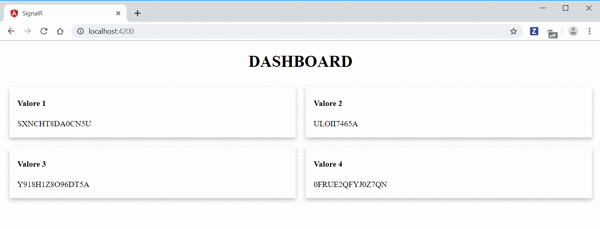

# **SignalR Angular e Asp.net core**

Supponiamo di voler creare un'applicazione web di monitoring, che quindi fornisce all'utente una dashboard che visualizza una serie di informazioni che si aggiornano nel tempo.
<br>
Un primo approccio per realizzare un'applicazione di questo tipo è quello di avere un api da chiamare ciclicamente a determinati intervalli di tempo (*polling*) per aggiornare i dati sulla dashboard.
<br>
Un'altro possibile approccio è quello di farsi mandare dal backend i dati quando questi sono cambiati (*push*).
<br>
Creerò la mia applicazione utilizzando il secondo approccio, servendomi di una libreria che prende il nome di **SignalR**

## SignalR

Libreria open source sviluppata da Microsoft che consente di aggiungere funzionalità web in tempo reale alle applicazioni.
<br>
Tutto questo si traduce nel dare la possibilità di effettuare un push dei dati dal server ai client connessi, anzichè attendere che siano questi ultimi a richiederli.
<br>
Con SignalR il server può chiamare un metodo JavaScript di tutti i suoi client connessi, oppure di un client specifico.
<br>
La connessione tra client e server è permanente, a differenza di una connessione HTTP classica, che sarà ristabilita ad ogni comunicazione.

## Demo

Dopo una breve introduzione a cosa voglio fare e alla libreria che utilizzerò per farlo, passiamo al codice.<br>

> Asp.net core

Creo un progetto Asp.Net core con template web-api.
Elimino il controller che ha creato.
Mediante Pacchetti Nuget aggiungo `Microsoft.AspNet.SignalR` al progetto.
A questo punto posso creare il mio Hub

```C#
using Microsoft.AspNetCore.SignalR;

namespace SignalR.Hubs
{
    public class NotificationHub : Hub { }
}
```
modifico `Startup.cs` per configurare SignalR, in particolare va aggiunta l'istruzione

``` C#
service.AddSignalR()
``` 
al metodo `ConfigureService` e 

```C#
app.UseSignalR(routes =>
{
    routes.MapHub<NotificationHub>("/notificationHub");
})
```
al metodo `Configure`, che sta ad indicare la rotta alla quale i client dovranno connettersi per poter ricevere i dati dal server.
<br>
Prossimo step, creare un job che avrà lo stesso ciclo di vita l'applicazione, e che generi i dati inviandoli ai client connessi mediante il `NotificationHub`.
<br>
.Net Core ci mette a disposizione l'interfaccia `IHostedService`

```C#
using System.Threading;
using System.Threading.Tasks;

namespace Microsoft.Extensions.Hosting
{
    //
    // Summary:
    //     Defines methods for objects that are managed by the host.
    public interface IHostedService
    {
        //
        // Summary:
        //     Triggered when the application host is ready to start the service.
        //
        // Parameters:
        //   cancellationToken:
        //     Indicates that the start process has been aborted.
        Task StartAsync(CancellationToken cancellationToken);
        //
        // Summary:
        //     Triggered when the application host is performing a graceful shutdown.
        //
        // Parameters:
        //   cancellationToken:
        //     Indicates that the shutdown process should no longer be graceful.
        Task StopAsync(CancellationToken cancellationToken);
    }
}
```

Che vado ad implementare con la mia classe `DashboardHostedService`.<br>
Lo scopo di questa classe è chiamare il metodo `SendAsync` del `NotificationHub` passandogli un oggetto contenente quattro stringhe generate in modo random.<br>
Utilizzo un timer per poter mandare messaggi ogni 2 secondi.

```C#
using Microsoft.AspNetCore.SignalR;
using Microsoft.Extensions.Hosting;
using SignalR.Hubs;
using System;
using System.Linq;
using System.Threading;
using System.Threading.Tasks;

namespace SignalR
{
    public class DashboardHostedService : IHostedService
    {
        private Timer _timer;
        private readonly IHubContext<NotificationHub> _hubContext;

        public DashboardHostedService(IHubContext<NotificationHub> hubContext)
        {
            _hubContext = hubContext;
        }

        public Task StartAsync(CancellationToken cancellationToken)
        {
            _timer = new Timer(DoWork, null, TimeSpan.Zero,
            TimeSpan.FromSeconds(2));

            return Task.CompletedTask;
        }

        private void DoWork(object state)
        {
            _hubContext.Clients.All.SendAsync("SendMessage", 
                new {
                    val1 = getRandomString(),
                    val2 = getRandomString(),
                    val3 = getRandomString(),
                    val4 = getRandomString()
                });
        }

        private string getRandomString()
        {
            Random random = new Random();
            const string chars = "ABCDEFGHIJKLMNOPQRSTUVWXYZ0123456789";
            return new string(Enumerable.Repeat(chars, random.Next(10, 16))
              .Select(s => s[random.Next(s.Length)]).ToArray());
        }

        public Task StopAsync(CancellationToken cancellationToken)
        {
            _timer?.Change(Timeout.Infinite, 0);

            return Task.CompletedTask;
        }
    }
}

```

aggiungo la seguente istruzione al metodo `ConfigureService`

```C#
services.AddHostedService<DashboardHostedService>();
```

in questo modo all'avvio dell'applicazione verrà avviato anche il mio job.

> Angular

Creo un nuovo progetto dalla ***Angular-Cli*** mediante il comando

```
ng new SignalR
```

Non intendo stare a complicarmi la vita creando component o routing particolari.<br>
Metto tutto in app.component.ts e app.component.html tranne ovviamente il servizio che mi farà da gateway per SignalR.<br>
Installo il pacchetto node per SignalR

```
npm i @aspnet/signalr
```
a questo punto occorre creare un service, il cui scopo è quello di connettersi all'hub creato in precedenza e di gestire eventuali messaggi.<br>

```Typescript
import { Injectable } from '@angular/core';
import * as signalR from '@aspnet/signalr';
import { Subject, Subscription } from 'rxjs';

@Injectable({
  providedIn: 'root'
})
export class SignalrService {
  private message$: Subject<any>;
  connection: signalR.HubConnection;

  constructor() {
    this.message$ = new Subject<any>();
  }

  public connect(success: (message) => void): Subscription {
    this.connection = new signalR.HubConnectionBuilder()
    .withUrl('http://localhost:2172/notificationHub')
    .build();

    this.connection.start().catch(err => console.log(err));

    this.connection.on('SendMessage', (message) => {
      this.message$.next(message);
    });

    return this.message$.subscribe(success);
  }

  public disconnect() {
    this.connection.stop();
  }
}
```

il codice che occorre per connettersi ad un hub SignalR è il seguente

```Typescript
connection: signalR.HubConnection;

this.connection = new signalR.HubConnectionBuilder()
    .withUrl('http://localhost:2172/notificationHub')
    .build();

this.connection.start().catch(err => console.log(err));
```

la prima istruzione permette di creare un oggetto di tipo signalR.HubConnection, che ci servirà per poter connetterci e gestire i messaggi inviati dal server.<br>
la seconda istruzione effettua la connessione vera e propria, loggando eventuali errori in console.

```Typescript
this.connection.on('SendMessage', (message) => {
  this.message$.next(message);
});
```
Ora non ci resta che indicare il metodo sulla quale siamo in ascolto e cosa farne del messaggio che ci arriva. <br>
Ho voluto creare un subject in modo tale che ogni volta che arriva il messaggio sia il chiamante del metodo *connect* a fare effettivamente qualcosa con i dati ricevuti e non il service.<br>
Il metodo inoltre restituisce una sottoscrizione, in modo tale che il chiamante possa chiuderla quando non è più necessaria.<br>
Vediamo come utilizzare il service nel component.<br>
Come ogni *service* va iniettato nel costruttore, quindi

```
constructor(private signalrService: SignalrService)
```

chiamo il metodo *connect* nel costruttore stesso e intercetto il messaggio in arrivo

```Typescript
this.signalRSubscription = this.signalrService.connect((message) => {
  this.content.val1 = message.val1;
  this.content.val2 = message.val2;
  this.content.val3 = message.val3;
  this.content.val4 = message.val4;
});
```
dove *this.signalRSubscription* è semplicemente un oggetto di tipo *Subscription*

```Typescript
private signalRSubscription: Subscription;
```
mentre *this.content* è un oggetto composto da quattro campi di tipo stringa
```Typescript
public content: {val1: string, val2: string, val3: string, val4: string}
```

infine implemento *OnDestroy* per poter togliere la sottoscrizione e chiudere la connessione all' hub SignalR in fase di chiusura dell'applicazione.

```Typescript
export class AppComponent implements OnDestroy

ngOnDestroy(): void {
  this.signalrService.disconnect();
  this.signalRSubscription.unsubscribe();
}
```

Ultime righe di codice rispettivamente in *app.component.html* e *app.component.css* per dare un minimo di stile e l'applicazione è completata.

```html
<div style="text-align:center">
  <h1>
    DASHBOARD
  </h1>
</div>

<div class="card-container">

  <div class="card">
    <div class="container">
      <h4><b>Valore 1</b></h4>
      <p>{{content.val1}}</p>
    </div>
  </div>

  <div class="card">
    <div class="container">
      <h4><b>Valore 2</b></h4>
      <p>{{content.val2}}</p>
    </div>
  </div>

  <div class="card">
    <div class="container">
      <h4><b>Valore 3</b></h4>
      <p>{{content.val3}}</p>
    </div>
  </div>

  <div class="card">
    <div class="container">
      <h4><b>Valore 4</b></h4>
      <p>{{content.val4}}</p>
    </div>
  </div>

</div>
```
```css
.card-container {
  display: flex;
  flex-wrap: wrap;
}

.card {
  box-shadow: 0 4px 8px 0 rgba(0,0,0,0.2);
  transition: 0.3s;
  width: 40%;
  flex-grow: 1;
  margin: 10px;
}

.card:hover {
  box-shadow: 0 8px 16px 0 rgba(0,0,0,0.2);
}

.container {
  padding: 2px 16px;
}

```

Avvio backend e frontend, il risultato finale è proprio ciò che mi volevo ottenere. Ottimo.


